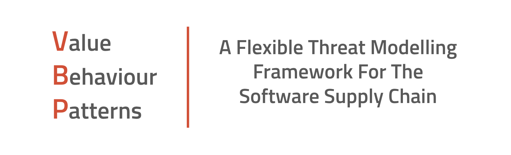

# VBP: Value, Behaviours & Patterns

## VBP Playbooks

VBP Playbooks are a way for practitioners to describe linearly how to use VBP to threat model a specifc target.  A good example is a new open-source project.  Imagine you are doing code review and you come across a new Javascript runtime being used in this project.  This open-source runtime is new to you and you don't know whether you trust it yet or not and want to threat model it.  A VBP playbook gives you the step-by-step tasks to do one after another to perform the threat modelling you need to do.

