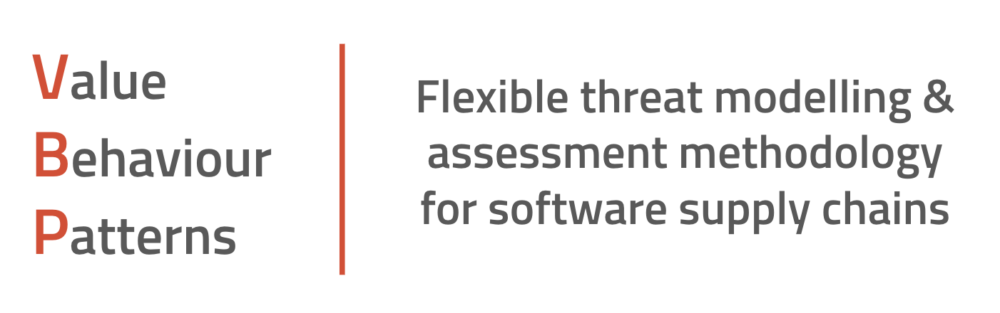
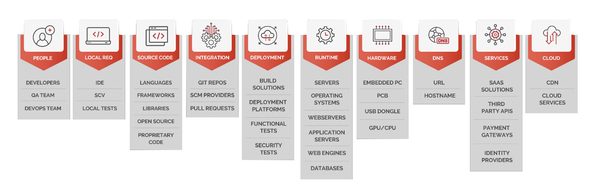

# VBP Framework

The reality is that modern applications are complex and dynamic, making them challenging to secure. They utilize browser-based programming languages, directly interact with online dependencies, and implement technologies like containers, serverless, and public cloud. Understanding these components, such as the public cloud components used, the identity provider in use, and the required infrastructure, is crucial for securing the application.

The supply chains supporting these applications are equally complex. They encompass developers and DevOps teams, CI/CD pipelines that build and deploy the apps, and the runtimes and cloud services that enable the apps to scale and operate.  I described the multiple stages of the software supply chain here: [https://gitlab.com/pmccarty/visualizing-software-supply-chain](https://gitlab.com/pmccarty/visualizing-software-supply-chain)

Organizations need a simple method to identify risks across their software supply chains to prioritize necessary work.  I developed the VBP framework as a practical threat modelling and assessment methodology for software supply chains.

VBP is highly flexible and can be applied to various targets: Applications, open-source projects, individual developers, DevOps teams, entire companies, and more. However, it really excels when applied to software supply chains.  Let's explore how the VBP framework operates.

## Background

As a full-time red teamer, I needed a way to systematically idenfity gaps in a software supply chain, so I could then target those gaps for my offensive security work. That's why I created the VBP framework.  Red teams, penetration testers, and bug bounty researchers can use this framework to prioritize their offensive operations. Similarly blue teams and DevOps teams can use this framework to help them proactively threat model their application environments to them prioritize their own mitigation and hardening tasks.

Feel free to use these shortcuts:

| [Value](#value) | [Behaviours](#behaviours) | [Patterns](#patterns) | [Howto](#how-to-use-vbp-practically) | [Tools](TOOLS.md) | [Playbooks](PLAYBOOKS.md) |

## Value

### Definition: 

What benefit would the target provide to an attacker?

### Description:

Identifying the potential value a target can offer an attacker is the first step in assessing risk. This target could be an individual developer, an application, or something else. For instance, a developer might be valuable because they have access to the intellectual property that is crucial for a significant project. Alternatively, an application might be valuable if it's used by government departments. The goal is to ascertain the value each target could bring to an attacker.

Here are some questions to consider when assessing the value of potential targets:

**Application:** What is the application's purpose? Does it deliver a service or product? Is it trusted or used in high trust situations? Does that application ask for sensitive data or provide sensitive data? Is the application public facing or internal? Is the application written by an internal team, or an external team? Does the application use off the shelf no-code or low-code platforms?

**Open-source project:** Which other applications or projects utilize this open-source project (OSP)? Is it used for sensitive functions like cryptography? Is the OSP up to date, or not being actively worked on? Do the maintainers of the project follow security best practices? Do the collaborators of the OSP follow security best practices?

**Individual software developer:** What software or internal systems does the developer have access to? Are the developer's workflows insecure, and can they be exploited? What kind of remote access does the engineer have? Do they have elevated permissions or standard permissions?

**Infrastructure:** What tech stack is in use? Which cloud providers are being used? Is it multi-tenanted or does it provide infrastructure to customers via single tenancy? Is a specific container used in multiple other projects?

**Data:** What kind of data does the target possess? Is it protected and sensitive? What would be the consequences if this data was misused?

**Company:** Who are the target customers? Are the company's customers government departments or other organizations that are common targets for attack?

## Behaviours

### Definition:

Traits of an individual human that makes that makes that person less secure

### Description:

Behaviours are the ongoing choices that an individual makes in their working life. These behaviours affect how they interact with work processes, and influences the tools and configurations they use. Behaviours can be thought of as the fingerprints that a person leaves as they do their job. Behaviours are the patterns of the individual that allow you to fingerprint them.

When identifying the behaviours of a person you are contemplating targeting here are some questions you can ask:

**Tools:** What tools do they use and how do they set them up? Do they tend to use a specific IDE? Specific plugins? Do they follow security best practices when interacting with work resources? What SaaS platforms do they like to use or integrate into their work? Do they use SSH keys, PAT tokens, JWT, etc?

**Configurations:** What unique configurations does a person use in their work? Do they like to work in feature branches and merge into dev? Or do they merge directly into main?

**Variables:** How does the person like to name things? Where do they like to store secrets? Do they use .env files or secret managers?

## Patterns

### Definition:

Repeated traits within an organization that compromise its security.

### Description: 

Patterns are common traits observable across various application environments. Initially, they emerge as individual behaviours which, over time, solidify into recurring patterns exhibited by teams, departments, and even entire companies. These patterns deviate from industry best practices, and can be considered as "anti-patterns". The name isn't crucial. What matters is our ability to recognize these patterns and leverage them during threat modelling and offensive operations.

When identifying the patterns of a potential target group, consider the following questions:

**Environments:** Does the organization name its environments as dev, staging, and prod, or do they use names like Hermes, Zeus, and Athena? Do these environments employ flat networks, or highly separated ones? Who has access to which environments, and who can modify them? Are certain roles granted access to all environments? Are security tools implemented in production, but not lower environments like development and testing? Are production environments always set up independently, or can development environments evolve into production? Are all environments public, or are lower ones like development and staging private?

**Source Code Management (SCM):** Does the organization use GitHub for all repositories, or GitHub for public and GitLab for private ones? Are teams using Yubikeys? Do they use SSH keys? Are they GPG signing commits? Who can approve merge requests or pull requests? Are team leads permitted to execute hot fixes or deviate from standard practices?

**Cloud:** Do all engineers have access to the cloud? Do they have explicit permissions or admin permissions? Who is responsible for cloud migration tasks? Is Infrastructure as a Code (IaC) used to build cloud environments, or are they manually constructed? Who manages application administration - DevOps, CloudOps, or developers? Do teams use VPN or other secure means to access cloud resources? Can you SSH or RDP directly to servers in the cloud?%

## How to use VBP practically

Here's how I personally use VBP:  First, I start with a target.  That target is usually either an application, a individual developer or most commonly, a company.  Once you know your target you can use the [Visualizing the Software Supply Chain](https://gitlab.com/pmccarty/visualizing-software-supply-chain) framework to identify what SSC stages are in the target, and what components are in each stage. It's important in this discovery period to identify as many components as possible so the use of tooling that can automate this for you is important.  You can find a list of tools that I've used successfully in the [Tools](TOOLS.md) section. 

I've developed several Playbooks that focus on types of targets.  You can find these in [Playbooks](PLAYBOOKS.md). 

## Playbooks

As part of our effort to make VBP something people will actually use, we want to encourage an ecosystem of open-source VBP Playbooks.  Each of these Playbooks will focus on a certain specific threat modelling use case.  For example, our first Playbook focuses on how to threat model a real public open-source project.  Moving forward we want to encourage VBP users to create their own Playbooks and share them with the community.  

You can see all of our Playbooks on the [Playbook Page](PLAYBOOKS.md)

Here are some example Playbooks:

[Open Source Project Playbook](playbooks/OPEN-SOURCE-PROJECT-VBP-PLAYBOOK.md)

[Cloud Native Application Playbook](playbooks/CLOUD-NATIVE-APPLICATION-VBP-PLAYBOOK.md)

### References

My original presentation at CrikeyCon 2021 where I first talked about VBP:

[https://docs.google.com/presentation/d/1mXhj-GT_A9hVy_QKtWJPg-UCcvApZW5y_gBpoyOYpG4/edit#slide=id.gc39213de60_0_1530](https://docs.google.com/presentation/d/1mXhj-GT_A9hVy_QKtWJPg-UCcvApZW5y_gBpoyOYpG4/edit#slide=id.gc39213de60_0_1530)

The Open Software Supply Chain Attack Reference (OSC&R) is a comprehensive list of the attack vectors and chain of events that attackers will use when they try to exploit the software supply chain.  This MITRE ATT&CK-like matrix post-dates my original work on VBP but now that it exists you can think of it as a companion to VBP.

[https://pbom.dev](https://pbom.dev)
