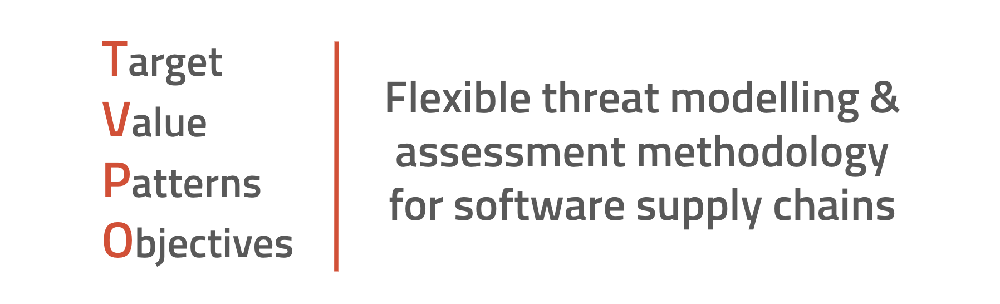

# TVPO Framework



## Open-Source Project TVPO Playbook

This TVPO Playbook is a step-by-step guide to threat modelling a public open-source project (OSP).  You can use this Playbook to conduct your own threat model on source code you've written yourself, or source code that you are integrated into an application.  Who owns the code isn't important, but understanding the risk related to that code is.

### Target

Our target for this Playbook is a single open-source repository. Let's use https://github.com/mjackson/unpkg as an example 

### Value

This open-source project is used for a popular CDN that hosts Javascript libraries.  It does this by mirroring NPM.  The value to an attacker is that if you compromise this library, you potentially compromise a whole CDN and any other projects that use those resources. 

### Patterns

Follow the [Playbook Steps](#playbook-steps) section to identify patterns that can be used by attackers.

### Objectives

1. Gain administrative access to the repo
2. Compromise the maintainer of the project
3. Deploy backdoor into the target repository
4. Compromise companies using this package or CDN to steal intellectual property

### Playbook Steps

1. Typically, an open-source project that you consume as a git repository will only involve 4 or 5 stages of the SSC: People, Developer Tools, Source Code, Integration, and sometimes Deployment.  Use the ["Visualizing Software Supply Chains"](https://github.com/SecureStackCo/visualizing-software-supply-chain) to identify what software supply chain stages are involved in your target SSC.

2. Git clone or fork the project to a local directory

3. People stage:
	- Identify all developers that have worked on the project by looking in the Contributors section, or by pulling commit authors from the code
	- Query Git for email addresses ``` git log --pretty=format:%ae | sort -u ```
	- Cross reference contributors to see if any are working on important projects?
	- Identify if developer persona is legitimate and hasn't been created recently
	- Identify if developers SCM account is new
	- Cross reference as many contributors as possible on LinkedIn to verify legitimacy
	- Identify whether contributor is a senior or lead engineer at company

4. Developer tool stage:
	- Look in source code for evidence of IDE's, plugins and other tooling 
	- Identify if local developer tools are up to date and secure
	- Look in .gitignore files for evidence of other tools
	- Identify if developers using containers locally on their laptops
	- Look for git hooks and other git files

5. Source code stage:
	- Scan source code for sensitive data like secrets and credentials
	- Scan source code for our of date and vulnerable third-party libraries with SCA tool
	- Scan source code with static analysis tools (SAST) and look for flaws in code
		- Are developers using out of date functions, classes or patterns?
		- Are developers following best practices when it comes to sanitizing input, obfuscation, etc?
	- Are private libraries or components being used?  NPM, RubyGems, PyPI, etc

7. Integration stage:
	- Identify if pull requests or merge requests are being used
	- Identify what other applications or projects use this OSP
		- Are any of the projects that use this OSP commercial in nature? 
		- Do any critical infrastructure projects use the target OSP?
	- Identify if project maintainer is signing their commits with GPG keys
	- Identify if project maintainer is using MFA to sign into SCM provider
	- Identify how many contributors are using GPG key signing for their commits
	- Identify how many contributors are using SSH keys to connect to SCM provider
	- Identify if the project is running any static analysis (SAST) tooling in a CI pipeline
	- Identify if the project is running any software composition analysis (SCA) tooling in a CI pipeline
	- Identify if the project is running any secret scanning tooling in a CI pipeline

8. Deployment stage:
	- Identify if there are build artifacts in CD pipeline
		- Containers
		- Zip files
		- Binaries
	- Identify if there are deployment variables in CD pipeline

	
### Attack Path

(Reminder: this is just an example!)

Collaborator --> Malicious PR --> Malware injection --> Customers Compromised

Fork Project --> Fix Bugs in Original Project --> Build Community Trust --> New Version --> Malware Injected --> Customers Compromised
