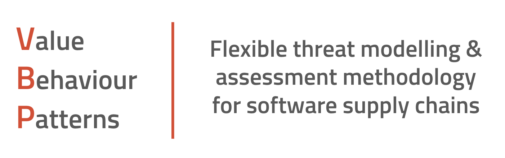

# VBP: Value, Behaviours & Patterns

## Open-Source Project VBP Playbook

This VBP Playbook is a step-by-step guide to threat modelling a public open-source project.  You can use this Playbook to conduct your own threat model on source code you've written yourself, or source code that you are integrated into an application.  Who owns the code isn't important, but understanding the risk related to that code is.

### Playbook Steps

1. Use the ["Visualizing Software Supply Chains"](https://github.com/SecureStackCo/visualizing-software-supply-chain) to identify what software supply chain stages are involved.

2. Typically, an open-source project that you consume as a git repository will only involve 4 stages of the SSC: People, Developer Tools, Source Code, and Integration.

3. Git clone or fork the project to a local directory

4. People stage:
	- Identify all developers that have worked on the project by looking in the Contributors section, or by pulling commit authors from the code
	- Query Git for email addresses 

5. Developer tool stage:
	- Look in source code for evidence of IDE's, plugins and other tooling 
	- Identify if local developer tools are up to date and secure

6. Source code stage:
	- Scan source code for sensitive data like secrets and credentials
	- Scan source code for our of date and vulnerable third-party libraries with SCA tool
	- Scan source code for sensitive data like secrets and credentials

7. Integration stage:
	- Identify if project maintainer is signing their commits with GPG keys
	- Identify if project maintainer is using MFA to sign into SCM provider
	- Identify how many contributors are using GPG key signing for their commits
	- Identify how many contributors are using SSH keys to connect to SCM provider

	
